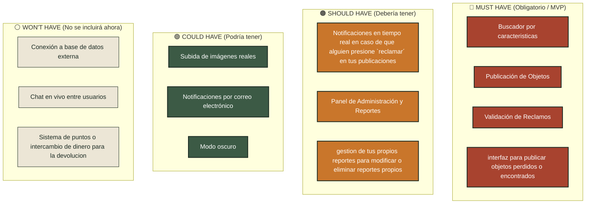

```mermaid
graph TD
    %% Estilos globales
    classDef must fill:#a8432f,stroke:#1b2a23,stroke-width:2px,color:#fff;
    classDef should fill:#c9762b,stroke:#1b2a23,stroke-width:2px,color:#fff;
    classDef could fill:#3c5a45,stroke:#1b2a23,stroke-width:2px,color:#fff;
    classDef wont fill:#ece6d6,stroke:#1b2a23,stroke-width:1px,color:#1b2a23;

    subgraph M["🔴 MUST HAVE (Obligatorio / MVP)"]
        M1[Buscador por caracteristicas]
        M2[Publicación de Objetos]
        M3[Validación de Reclamos]
        M4[interfaz para publicar objetos perdidos o encontrados]
    end

    subgraph S["🟠 SHOULD HAVE (Debería tener)"]
          S1[Notificaciones en tiempo real en caso de que alguien presione `reclamar´ en tus publicaciones]
        S2[Panel de Administración y Reportes]
        S3[gestion de tus propios reportes para modificar o eliminar reportes propios]
    end

    subgraph C["🟢 COULD HAVE (Podría tener)"]
        C1[Subida de imágenes reales]
        C2[Notificaciones por correo electrónico]
        C3[Modo oscuro]
    end

    subgraph W["⚪ WON'T HAVE (No se incluirá ahora)"]
        W1[Conexión a base de datos externa]
        W2[Chat en vivo entre usuarios]
        W3[Sistema de puntos o intercambio de dinero para la devolucion]
    end

    %% Asignación de estilos
    class M1,M2,M3,M4 must;
    class S1,S2,S3 should;
    class C1,C2,C3 could;
    class W1,W2,W3 wont;
```
